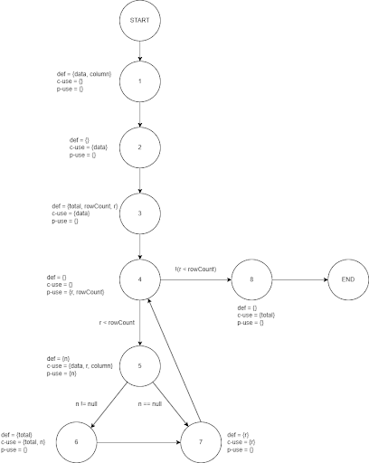

**SENG 637 - Dependability and Reliability of Software Systems**

**Lab. Report #3 – Code Coverage, Adequacy Criteria and Test Case Correlation**

| Group \#: 12     |     |
| -------------- | --- |
| Student Names: |  Andrew Lee   |
|                |  Dillon Pullano   |
|                |  Jonathan Lui   |
|                |  Gi-E Thang   |
|                |  Yaad Sra   |

# 1 Introduction

This report details the process and findings through the completion of Assignment 3. This assignment focused on unit testing using JUnit and enhancing our understanding and application of white-box testing techniques, specifically aiming for improved code coverage of the JFreeChart system. Our objectives included using code coverage tools to measure test adequacy, designing test cases to enhance coverage, understanding the benefits and drawbacks of these tools, and manually calculating data-flow coverage for deeper insight.

# 2 Manual data-flow coverage calculations for X and Y methods

The two methods that we will be manually measuring data flow coverage calculations for are the DataUtilities.calculateColumnTotal and Range. intersects methods. For each of the following 2 subsections, we will be presenting our data flow graphs (made through draw.io), the def-use sets and DU-pairs per variable (in a single table), and a table that shows which pairs are covered for each test case.

#### Manual Calculations for DataUtilities.calculateColumnTotal Function

Figure 1 below shows the data flow graph for the calculateColumnTotal function from the DataUtilities class:

Figure 1. The data flow graph for the calculateColumnTotal function from the DataUtilities class

The def-use sets per statement are represented in the above figure. Table 1 includes a list of all DU-pairs per variable (bottom half of table) for the calculateColumnTotal function from the DataUtilities class:

Table 1. List of all DU-pairs per variable for the calculateColumnTotal function from the DataUtilities class

Table 2. The calculation for the DU-pair coverage for the calculateColumnTotal function from the DataUtilities class

Table 3 below shows the calculation for the DU-pair coverage for the calculateColumnTotal function from the DataUtilities class for each test that was implemented in our test suite:

Table 3. Calculations for the DU-pair coverage for the calculateColumnTotal function from the DataUtilities class for each test that was implemented in our test suite

#### Manual Calculations for Range.intersects Function
Figure 2 below shows the data flow graph for the intersects function from the Range class: 

Figure 2. The data flow graph for the intersects function from the Range class

Table 4 below includes the def-use sets per statement represented in Figure 2. It also includes a list of all DU-pairs per variable (bottom half of table) for the intersects function from the Range class: 

Table 4. Shows the def-use sets per statement represented in Figure 2. Also shows the list of all DU-pairs per variable (bottom half of table) for the intersects function from the Range class

Table 5. Shows the calculation for the DU-pair coverage for the intersects function from the Range class

Table 6. Shows the calculation for the DU-pair coverage for the intersects function from the Range class for each test that was implemented in our test suite

# 3 A detailed description of the testing strategy for the new unit test

Our testing strategy for this assignment was framed around applying white-box testing techniques, and achieving high coverage metrics, initially targeting 90% statement coverage, 70% branch coverage, and 60% condition coverage for the tests that were written for the DataUtilities and Range classes. 

Since we decided to use EclEmma for coverage testing, we needed to use instruction coverage instead of statement coverage and method coverage instead of condition coverage. Therefore, our overarching goals for testing are based on the following coverage criteria:

- 90% instruction coverage (replacing statement coverage)
- 70% branch coverage
- 60% method coverage (replacing condition coverage)

We planned to expand upon our test suite while working in a group. This approach allowed us to explore ideas on how to improve coverage together while looking at the course notes and other online materials. The tests would be expanded/optimized for the following methods in the DataUtilities and Range classes:

- “calculateColumnTotal” function
- “calculateRowTotal” function
- “createNumberArray” function
- “createNumberArray2D” function
- “getCumulativePercentages” function
- "contains" function
- "expand" function
- "getLength" function
- "intersects" function
- "getLowerBound" function

The first step in implementing our testing strategy to meet the adequacy criteria defined above was to run initial coverages from our test suite that was submitted for assignment 2 using the EclEmma Eclipse extension to get a better idea of which tests were not meeting expectations or were being processed incorrectly. 

The second step was to focus on the tests with low coverages to see if there were modifications we could implement to increase coverages. We found that any test that was written that incorporated JMock objects would not be evaluated correctly for any of the 3 coverage metrics. We modified these tests to use double data types instead. Once these were updated, the coverages in all 3 metrics increased.
The third step was to increase branch coverage, which seemed to be much lower than the other 2 metrics after an initial evaluation. For branch coverages, we planned to add conditional statements and loops where necessary into tests where it made sense (such as with the Range.intersects tests). 

The last step was to add tests where necessary to increase coverage to meet the minimum coverage criteria. Changes would be made, followed by rerunning the EclEmma to see how the changes either increased (or decreased) coverage for that test. This iterative process was followed until we hit our desired coverages for both sets of tests under all 3 coverage criteria.

# 4 A high level description of five selected test cases you have designed using coverage information, and how they have increased code coverage

For the Range.intersects method, we combined all 11 test cases into one test case. We increased the branch coverage to 100% from no coverage by allowing all the scenarios within the test to be covered.

Before:

Figure 3: The initial code for the Range intersects method
After:

Figure 4. The final code for the Range intersects method

Figure 5. The final Branch coverage for the Range intersects method

For the Range Expand method, we combined the 5 test cases into one test case. It increased the coverage instruction from an average of 55.1% to 100%. This means it was able to execute all the lines and decrease the amount of lines needed for the test.

Before:

Figure 6. The Initial code for the Range Expand method

After:

Figure 7. The final code for the Range expand method

Figure 8. The final instruction coverage for the Range expand method

For the DataUtilities calculateColumnTotal we had an initial instruction coverage of 34.15% and we were able to increase it to an average 82.15% by removing mocking. By doing so, all the lines were properly executed.

Before:

Figure 9: The initial code for the DataUtilities calculateColumnTotal method

After:

Figure 10. The final code for DataUtilities calculateColumnTotal method

Figure 11. The final instruction coverage for DataUtilities calculateColumnTotal method

# 5 A detailed report of the coverage achieved of each class and method (a screen shot from the code cover results in green and red color would suffice)

The coverage metrics that we used were “Instruction Coverage”, “Branch Coverage”, and “Method Coverage”. The reason we used “Instruction Coverage” and “Method Coverage” instead of the specified “Statement Coverage” and “Condition Coverage” is because these were the types of comparable coverages that are available through the EclEmma coverage framework. 

#### Initial DataUtilities Coverage Report

Figure 12 below shows the DataUtilities_Initial_Instruction_Coverage:

Figure 12. The DataUtilities_Initial_Instruction_Coverage

Figure 13 below shows the DataUtilities_Initial_Branch_Coverage:

Figure 13. The DataUtilities_Initial_Branch_Coverage

Figure 14 below shows the DataUtilities_Initial_Method_Coverage:

Figure 14. The DataUtilities_Initial_Method_Coverage

The initial coverages for the DataUtilities test suites that we designed in Assignment 2 were 52.6%, 100%, and 96.6% for the instruction, branch, and method coverages respectively. One thing to note here is that the branch coverage only evaluated one of our tests even though we had other tests that should have been evaluated.

#### Final DataUtilities Coverage Report

Figure 15 below shows the DataUtilities_Final_Instruction_Coverage:

Figure 15. The DataUtilities_Final_Instruction_Coverage

Figure 16 below shows the DataUtilities_Final_Branch_Coverage:

Figure 16. The DataUtilities_Final_Branch_Coverage

Figure 17 below shows the DataUtilities_Final_Method_Coverage:

Figure 17. The DataUtilities_Final_Method_Coverage

The final coverages for the DataUtilities test suites that we designed in Assignment 2, and modified for Assignment 3 were 95.6%, 100%, and 95.5% for the instruction, branch, and method coverages respectively. By modifying our functions to not include JMock objects, the Branch coverages were evaluated for all possible tests, compared to the initial tests where they were ignored by EclEmma. Our changes to our DataUtilities test suite have met the minimum specified coverages.

#### Initial DataUtilities Coverage Report

Figure 18 below shows the Range_Initial_Instruction_Coverage:

Figure 18. The Range_Initial_Instruction_Coverage

Figure 19 below shows the Range_Initial_Branch_Coverage:

Figure 19. The Range_Initial_Branch_Coverage

Figure 20 below shows the Range_Initial_Method_Coverage:

Figure 20. The Range_Initial_Method_Coverage

The initial coverages for the Range test suites that we designed in Assignment 2 were 82.7%, 41.7%, and 95.5% for the instruction, branch, and method coverages respectively. Our modifications to our test suite therefore need to address instruction and branch coverages to meet the minimum thresholds specified in this assignment.

#### Final Range Coverage Report

Figure 21 below shows the FigureRange_Final_Instruction_Coverage:

Figure 21. The FigureRange_Final_Instruction_Coverage

Figure 22 below shows the Range_Final_Branch_Coverage:

Figure 22. The Range_Final_Branch_Coverage

Figure 23 below shows the Range_Final_Method_Coverage: 

Figure 23. The Range_Final_Method_Coverage 

The final coverages for the Range test suites that we designed in Assignment 2, and modified for Assignment 3 were 98.6%, 71.4%, and 95.5% for the instruction, branch, and method coverages respectively. By modifying our functions to not include JMock objects, the Branch coverages were evaluated for all possible tests, compared to the initial tests where they were ignored by EclEmma. Our changes to our DataUtilities test suite have met the minimum specified coverages.

# 6 Pros and Cons of coverage tools used and Metrics you report

We initially used EclEmma to run coverage testing. We were getting insufficient results so we decided to try using another framework (CodeCover) to see if the results were consistently bad. While some of us were working on integrating CodeCover into our project (to no avail), other group members were still trying to play around with our tests to see if they could achieve better results through EclEmma. 

The group took a while to understand that the reason we were getting insufficient results for a lot of our tests was that EclEmma was not properly executing any of the JMock objects, along with any lines of code in the test after them. After modifying our code to not use JMock objects, we were able to achieve results above the thresholds for instruction, branch, and method coverages. A summary of the pros and cons can be seen below:

#### ECLEmma:
#### Pros:
- It was easy to install through the Eclipse Marketplace and integrated easily
- Had an intuitive interface for switching between different types of coverages (instruction, branch, method)
- Once we converted our unit tests so that they did not have JMock objects, the tests passed all minimum coverages set out in the assignment handout

#### Cons:
- This was not executing the JMock objects along with any lines in a test after JMock was attempted
- Only has Branch coverage out of the ones asked for in the report. Offers alternatives to statement and condition coverage (instruction and method respectively)
- Did not have access to statement coverage or condition coverage, so we needed to go with instruction and method coverages respectively

#### CodeCover:
##### Pros:
- Had functionality for statement, branch, and condition coverages built into it to match the exact metrics asked for in the assignment handout

##### Cons:
- Harder to integrate into Eclipse
- Was consistently having dependency issues 

# 7 A comparison on the advantages and disadvantages of requirements-based test generation and coverage-based test generation.

An advantage of Requirements-Based Testing is that it ensures that all functionalities specified in the requirements are tested, but a disadvantage is that it may miss defects in unanticipated or misinterpreted requirements. 

An advantage of Coverage-Based Testing is that it helps uncover these gaps by ensuring all code paths are exercised, but a disadvantage is that it can lead to generating tests that have little relevance to actual use cases, potentially missing higher-level integration issues.

# 8 A discussion on how the team work/effort was divided and managed

The completion of this assignment was done collaboratively through long meetings over Discord. When we first met up after making our test plan, half of us worked on evaluating the initial Range coverages, while the other half worked on evaluating the initial DataUtilities coverages. We worked in two teams as well for the manual data flow graphs and DU-pairs. The fifth group member was working on sections of the report while assisting both groups when needed during this stage.

We found that coordinating through a group chat allowed us to explore concepts deeper individually and present our findings to the rest of the group. We eventually combined our changes on one team member's computer to get the final coverage results. We believe that this approach to task management was effective, and ensured that we all contributed to the completion of this assignment. 

# 9 Any difficulties encountered, challenges overcome, and lessons learned from performing the lab

One of the challenges that we encountered for this assignment was getting EclEmma to correctly execute our tests that used JMock objects. If we had known that JMock objects would break down when applying these coverage tests, we would have never used them where possible for assignment 2. This is a lesson that we will take forward with us when creating any future test suites.

It was also a bit of a learning curve to learn how to interpret results from EclEmma. The online resources were helpful to overcome this challenge, and working as a group we were able to share solutions to this. Another learning curve was associated with manually working through the data flow graphs. This was challenging at first, but the course notes and the provided resource (code2flow) helped us to visualise what needed to be done to complete this. 

# 10 Comments/feedback on the lab itself

This lab provided us with the opportunity to work on valuable hands-on experience with white-box testing techniques and the use of coverage tools such as EclEmma and CodeCover. We found that at times it was difficult to trace the initial description of the different tasks with the marking scheme that was defined at the bottom of the assignment handout. While we found this assignment challenging, we feel like we have learned more practical knowledge about white-box and coverage testing through the completion of this assignment.

